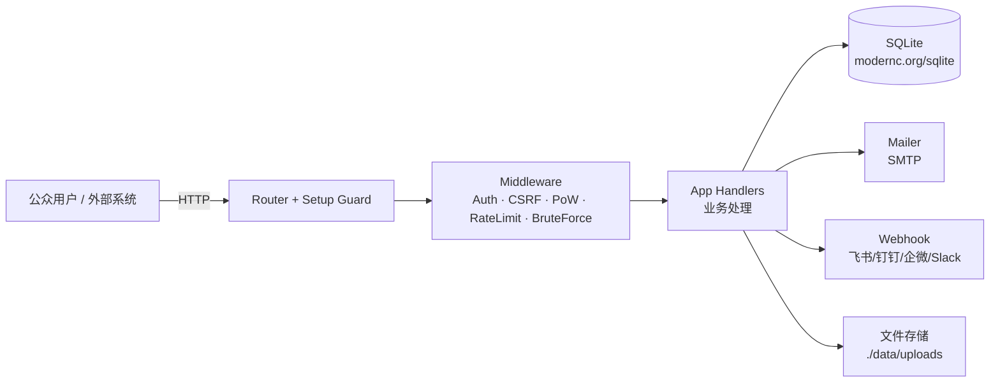

# FeedShit

<p align="center">
  
  
  
</p>

> 轻量级多项目反馈收集系统 · [GitHub 项目地址](https://github.com/Asunano/FeedShit)

FeedShit 是一个用 Go 编写的**单二进制、零外部依赖**的多项目用户反馈收集系统。它提供面向公众的反馈提交页、完整的多管理员后台（含细粒度 RBAC）、外部系统 API 接入、Webhook 通知、邮件通知与提交者自助追踪，所有前端页面以原生 HTML/CSS/JS 形式编译进二进制，无需额外构建步骤。

## 功能特性

**收集与提交**
- **多项目管理** — 每个项目拥有独立的反馈页与专属链接 `/fb/{slug}`，支持自定义 `form_schema` 与分类字典
- **公开反馈页** — 自适应表单，支持图片/日志上传、分类选择、自定义字段
- **工作量证明（PoW）** — 基于 SHA-256 前导零的客户端计算，防自动化垃圾提交；带 nonce 重放防护
- **IP 限速** — 每 IP 每小时提交次数限制（默认 10，Docker 镜像覆盖为 3）
- **提交者自助追踪** — 通过跟踪令牌在 `/track` 查看处理状态并可追加回复
- **文件上传安全** — 扩展名白名单 + 文件魔数（magic bytes）校验，SVG 自动清洗 XSS

**管理与协作**
- **多管理员团队** — `admins` 表存储账号，角色分 `admin / manager / editor / viewer`
- **细粒度 RBAC** — `member_grants`（管理员 × 项目 × 分类 → 角色）实现项目/分类级数据隔离
- **反馈全生命周期** — 状态（pending/processing/resolved/closed）、优先级（low/medium/high/urgent）、标签、指派、重复标记、内部备注与公开回复
- **批量操作** — 批量删除/改状态/改标签/改指派/改优先级/改分类
- **审计日志** — 记录登录、增删改、导入导出等关键操作
- **仪表盘与图表** — 总量/今日/项目统计、每日趋势、状态分布、分类分布

**集成与通知**
- **邮件通知（SMTP）** — 新反馈通知管理员、状态变更/公开回复通知提交者；支持自定义邮件模板（占位符 `{{project}}` `{{title}}` `{{description}}` `{{status}}` `{{admin_url}}` 等，用户内容做 HTML 转义）
- **Webhook 通知** — 自动适配飞书 / 钉钉 / 企业微信 / Slack / 通用 JSON，事件含 new_feedback、status_change、new_note、priority_change、assignee_change
- **外部系统 API Token** — 通过 `Bearer` 令牌（`/api/v1/external/feedback`）接受 CI、监控等系统的程序化提交
- **CSV 导入/导出** — 导出带 Excel UTF-8 BOM；导入兼容中/英表头

**运维**
- **自动备份** — 启动即备份，每日 03:00 定时 `VACUUM INTO` 备份；支持手动备份与按天清理旧备份
- **数据归档** — 手动或按天数自动将长期未处理的反馈置为 closed
- **Slug 历史重定向** — 项目 slug 改名后旧链接自动 301 跳转
- **健康检查** — `/health` 校验数据库连通性，便于容器探针
- **CDN/代理兼容** — 可配置可信代理与 CDN 厂商（auto / cloudflare / generic / none）以准确获取真实客户端 IP

## 架构概览



**分层结构**

| 层 | 包 | 职责 |
|----|----|------|
| 入口 | `cmd/feedshit` | 加载配置、初始化 DB 与组件、启动备份调度、优雅停机、配置可信代理 |
| 配置 | `internal/config` | 从环境变量读取运行配置 |
| 数据层 | `internal/database` | SQLite 访问（手动 RWMutex 串行化）、Schema 迁移、CRUD、RBAC 授权、备份/导入导出 |
| 业务层 | `internal/app` | 全部 HTTP 处理器（提交、后台、项目、分类、备注、RBAC、Webhook、邮件模板、CSV、归档） |
| 中间件 | `internal/middleware` | 会话认证、角色鉴权、CSRF、PoW 校验、限速、登录暴力破解防护、nonce 重放缓存、CDN IP 识别 |
| 邮件 | `internal/email` | SMTP 通知与自定义模板渲染 |
| 路由 | `internal/routes` | 路由注册、安装前置守卫、内嵌前端 HTML |

**请求流程**
1. 所有请求先经 `setupGuard`：未完成初始设置时仅放行 `/health`、`/setup`、`/api/v1/setup/*`、`/fb/`、`/track`、`/api/v1/track/*`，其余 API 返回 `503`、页面跳转 `/setup`
2. 公众提交经限速 + PoW + nonce 校验后入库，并异步触发邮件/Webhook
3. 管理 API 经会话认证 + CSRF（写操作）+ 角色中间件（部分接口额外要求 editor/admin）后由 handler 处理；非 admin 角色按 `member_grants` 做项目/分类级数据隔离

> 前端 6 个页面（`index` / `setup` / `login` / `feedback` / `track` / `admin`）在编译期通过 `go:embed` 打包进二进制，`/fb/{slug}` 页面在请求时把项目信息注入 `feedback.html` 的 `/*__PROJECT_DATA__*/` 占位符。后台 `admin.html` 为带 hash 路由的单页应用，无独立构建步骤。

## 目录结构

```
├── cmd/feedshit/            # 程序入口
├── internal/
│   ├── app/                 # HTTP 处理器（业务逻辑主体）
│   ├── config/              # 环境变量配置
│   ├── database/            # SQLite 数据层（modernc.org/sqlite）
│   ├── email/               # SMTP 邮件发送与模板
│   ├── middleware/          # 认证 / CSRF / PoW / 限速 / RBAC
│   └── routes/              # 路由注册 + 前端 HTML
│       └── frontend/        # 内嵌前端页面（login/index/setup/track/feedback/admin）
├── test/                    # 测试相关
├── Dockerfile               # 多阶段 alpine 构建，CGO_ENABLED=0
└── docker-compose.yml
```

## 数据模型

SQLite 数据库位于 `./data/feedbacks.db`（WAL 模式，单连接 + 手动 RWMutex 串行化）。

| 表 | 说明 |
|----|------|
| `feedbacks` | 反馈主表：标题、描述、`custom_data`(JSON)、`file_paths`(JSON)、状态、标签、指派、优先级、联系人、跟踪令牌、重复标记、分类、时间戳 |
| `projects` | 反馈项目：`slug`、`name`、`description`、`is_active`、`is_archived`、`form_schema` |
| `categories` | 项目级分类字典（key / name / color / sort_order / is_active） |
| `admins` | 管理员账号（bcrypt 密码哈希、角色、启用状态） |
| `member_grants` | 细粒度授权：`admin_id × project_slug × category_key → role`（`*` 表示该项目全部分类） |
| `feedback_notes` | 反馈备注/回复（`is_public` 区分管理员内部备注与对提交者可见的公开回复） |
| `api_tokens` | 外部系统接入令牌（`fs_` 前缀，可按项目限定） |
| `config` | 键值配置（邮件、系统、Webhook、CDN 等，运行时优先生效） |
| `audit_logs` | 操作审计日志 |
| `slug_history` | 项目 slug 改名后的重定向历史 |

## API 参考

基础前缀：`/api/v1`。除登录与公开接口外，管理接口需在 Cookie `admin_session` 中携带有效会话，且写操作需 `X-CSRF-Token` 头（双提交 Cookie 模式）。

### 公开接口
| 方法 | 路径 | 说明 |
|------|------|------|
| GET | `/health` | 健康检查（含 DB 连通性） |
| GET | `/api/v1/setup/status` | 安装状态与 PoW 难度 |
| POST | `/api/v1/setup` | 完成初始设置（创建管理员） |
| GET | `/api/v1/projects` | 列出启用且未归档的项目 |
| POST | `/api/v1/feedback/submit` | 公众提交反馈（限速 + PoW + nonce） |
| GET | `/api/v1/track/feedback?token=` | 提交者按令牌查询自己反馈的状态与公开备注 |
| POST | `/api/v1/track/reply` | 提交者追加回复（限速） |
| POST | `/api/v1/external/feedback` | 外部系统经 `Bearer` API Token 提交 |

### 管理接口（认证 + CSRF）
| 分组 | 路径（前缀 `/api/v1/admin`） | 角色要求 |
|------|------|------|
| 会话 | `/login`、`/logout`、`/csrf-token`、`/me` | 登录公开，其余已登录 |
| 仪表盘 | `/stats`、`/project-stats`、`/chart-data` | 已登录 |
| 反馈 | `/feedbacks`、`/feedbacks/export`(CSV)、`/feedbacks/:id` 及 `status`/`assignee`/`priority`/`category` 修改、`/feedbacks/:id/notes`、`/feedbacks/bulk-*` | 默认已登录；部分写操作需 editor+ |
| 项目 | `/projects`(GET/POST/PUT)、`/projects/:id/archive`、删除 | POST/PUT 需 editor+，归档/删除需 admin |
| 分类 | `/projects/:id/categories`、`/categories/:id` | 创建/改分类需 editor+，删除需 admin |
| 团队 | `/admins`、`/admins/:id`、`/admins/:id/grants*` | admin |
| API Token | `/api-tokens`、`/api-tokens/:id` | admin |
| 数据 | `/import/csv`(editor+)、`/archive`、`/prune-backups`、`/backup`、`/audit-logs` | 归档/清理/备份需 admin |
| 配置 | `/config/email`、`/config/account`、`/config/system`、`/config/email-template` | admin |

> 角色层级：`admin(4) > manager(3) > editor(2) > viewer(1)`。非 admin 用户额外受 `member_grants` 约束，只能访问被授权项目（及其中被授权的分类）。

## 配置

配置来源优先级：**运行时数据库 `config` 表 > 环境变量 > 代码默认值**。

| 环境变量 | 代码默认 | 说明 |
|----------|----------|------|
| `PORT` | `8080` | 监听端口 |
| `DATA_DIR` | `./data` | 数据目录（DB / 上传 / 备份均在其下） |
| `ADMIN_USERNAME` | `admin` | 默认管理员（安装向导可覆盖并写入 DB） |
| `ADMIN_PASSWORD` | `changeme` | 默认密码（安装向导设置后改为 bcrypt 哈希） |
| `BASE_URL` | `http://localhost:8080` | 邮件/链接中的基础地址 |
| `POW_DIFFICULTY` | `4` | PoW 前导零位数（1–10） |
| `RATE_LIMIT_PER_HOUR` | `10` | 每 IP 每小时提交上限（Docker 镜像覆盖为 `3`） |
| `MAX_UPLOAD_MB` | `20` | 单请求最大上传体积 (MB) |
| `SMTP_HOST` / `SMTP_PORT` | `""` / `587` | SMTP 服务器与端口 |
| `SMTP_USER` / `SMTP_PASS` | `""` | SMTP 凭据 |
| `SMTP_FROM` / `SMTP_TO` | `""` | 发件人 / 收件人（逗号分隔） |
| `NOTIFY_ENABLE` | `false` | 是否启用邮件通知 |
| `WEBHOOK_URL` | `""` | ⚠️ 已废弃：全局 `webhook_url` 不再触发出站通知，请改用后台「Webhook 订阅」（带 HMAC 签名） |
| `TRUSTED_PROXIES` | `""` | 可信代理 IP（逗号分隔，`*` 表示全部），用于读取 CDN 头获取真实 IP |
| `FEEDSHIT_MASTER_KEY` | （必填） | AES-GCM 主密钥（32 字节原始值，或 64 位十六进制），仅环境变量；缺失即启动失败。用于加密落库 SMTP 密码 / Webhook secret |
| `API_TOKEN_DEFAULT_RATE_LIMIT` | `60` | 新建外部 API Token 的默认每小时速率上限（0 = 不限） |
| `BACKUP_RETENTION_DAYS` | `30` | 每日备份保留天数，超过则自动清理 |

以上邮件/系统/Webhook/CDN/可信代理等多数设置也可在后台「设置」页配置并持久化到 DB。

## 部署

### Docker（推荐）

> 部署前请先阅读运维手册 [`docs/runbook.md`](docs/runbook.md)（重点：禁止 `scale > 1`、单实例约束、备份恢复、升级回滚），并复制 [`\.env.example`](.env.example) 为 `.env` 填入真实配置（尤其是 `FEEDSHIT_MASTER_KEY`）。

```bash
cp .env.example .env   # 编辑 .env，设置 FEEDSHIT_MASTER_KEY 等
docker compose up -d
```

访问 `http://localhost:8080`，首次访问自动跳转安装向导。`./data` 已挂载为卷，持久化数据库、上传文件与备份。镜像使用不可变版本 tag（`feedshit:${TAG:-1.0}`），**不要**在 compose 中使用裸 `latest`。

### 本地构建

```bash
# 需要 Go 1.26+
go build -o feedshit ./cmd/feedshit/
./feedshit
```

二进制为纯静态（CGO 关闭），可直接拷贝到目标服务器运行。生产环境**必须**设置 `FEEDSHIT_MASTER_KEY`（缺失即启动失败）、`ADMIN_PASSWORD`、`TRUSTED_PROXIES` 等，并通过后台完成初始设置。

## 使用流程

1. 部署后访问首页，完成安装向导（设置管理员账号与密码）
2. 进入后台 `/admin`，创建反馈项目并配置分类字典
3. 每个项目生成专属反馈链接 `/fb/{slug}`，分发给用户收集反馈
4. 新反馈触发邮件/Webhook 通知；可在后台分配优先级、指派处理人、添加备注、标记重复
5. 提交者凭跟踪令牌在 `/track` 查看进度并回复
6. 处理完成后更新状态；可定期归档旧数据、导出 CSV 或手动备份

## 安全说明

- 管理员密码使用 bcrypt 哈希；登录有暴力破解锁定的 IP 级防护（15 分钟内达上限锁定）
- 管理写操作强制 CSRF 双提交 Cookie 校验
- 公众提交需通过 PoW 与 nonce 重放校验，并受每 IP 限速约束
- 文件上传经扩展名白名单与魔数校验，SVG 内容自动剥离 `<script>`、事件属性与 `javascript:` 链接；附件访问做路径穿越防护（含 `EvalSymlinks` 解析）
- 邮件模板中用户可控内容统一做 HTML 转义，防止邮件客户端 XSS
- 真实客户端 IP 仅在配置了可信代理且连接来源可信时才从 CDN 头读取
- 敏感凭据（SMTP 密码、Webhook 订阅 secret）以 AES-GCM 加密落库，主密钥仅来自 `FEEDSHIT_MASTER_KEY` 环境变量，数据库导出/备份不含明文
- 外部 API Token 新建时套用默认每小时限速（`API_TOKEN_DEFAULT_RATE_LIMIT`，默认 60），防止令牌泄露后被滥用刷量
- 每日备份后按 `BACKUP_RETENTION_DAYS`（默认 30）自动清理旧备份，避免磁盘无限增长

## License

MIT
