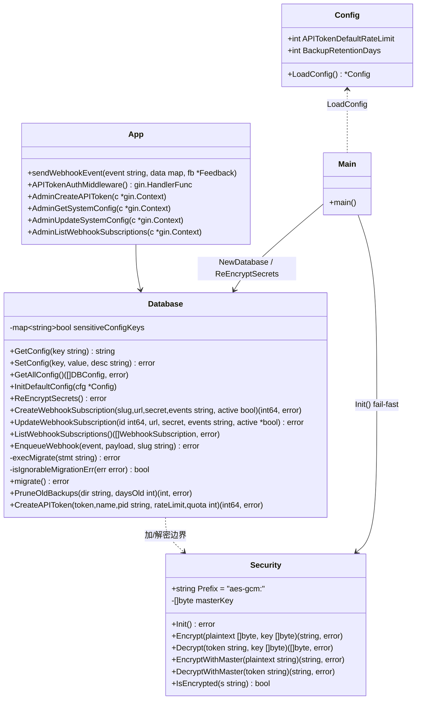
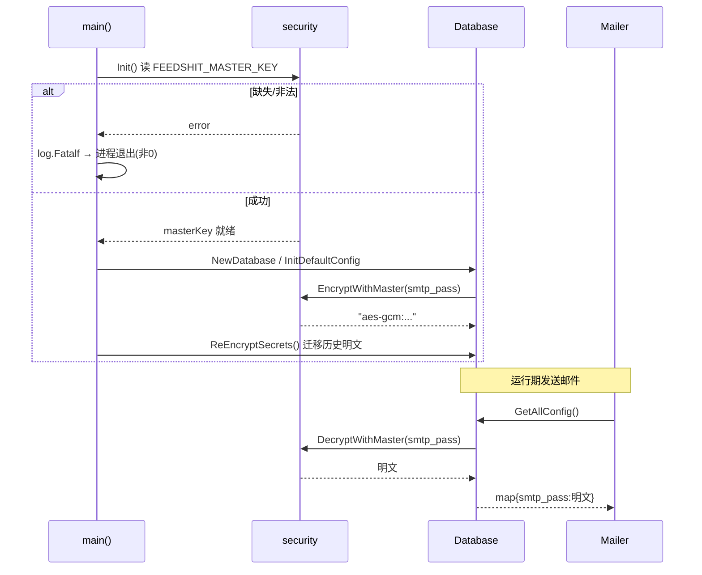
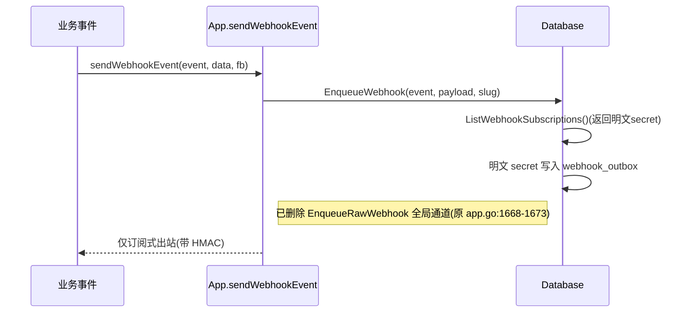
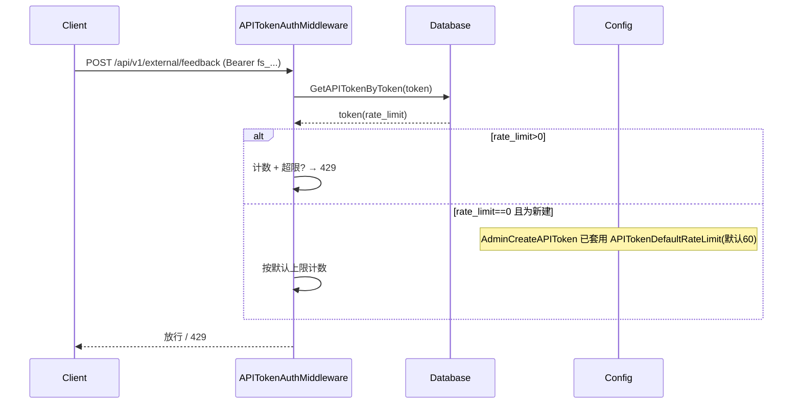
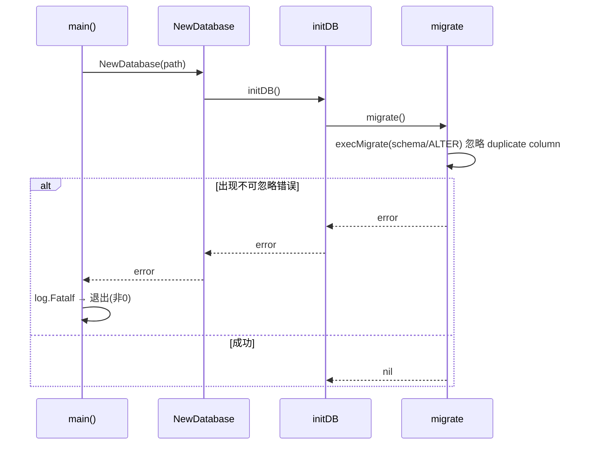
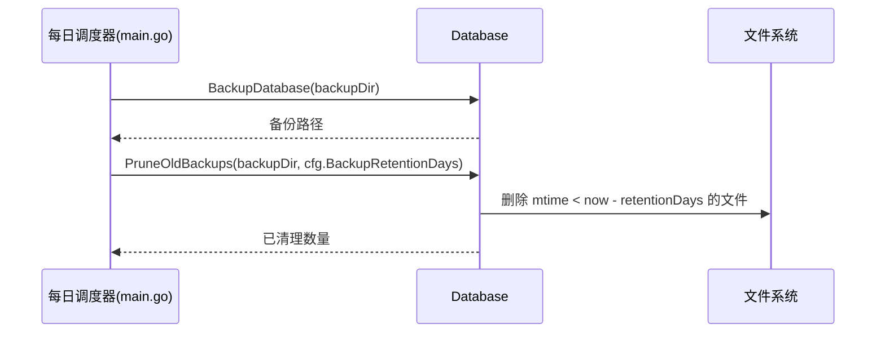
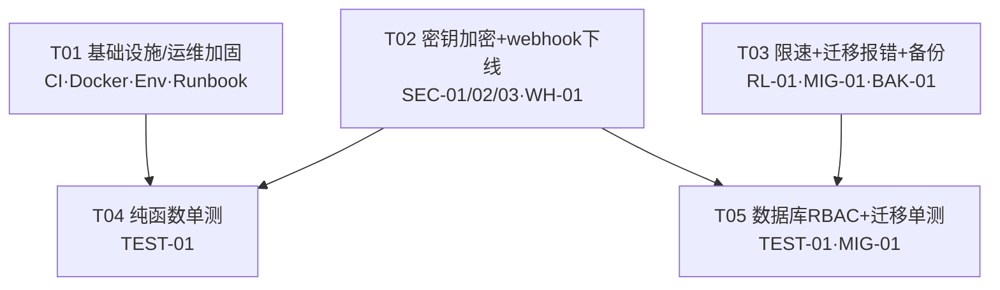

# FeedShit 架构改进 · 阶段0+1 架构设计 + 任务分解

> 文档类型：架构师产出（SOP 标准格式）
> 作者：高见远（架构师）
> 日期：2026-07-19
> 权威依据：`deliverables/feedshit-phase01-prd.md`
> 决策依据：用户已拍板 (a) AES-GCM 加密落库 / (b) legacy webhook 下线 / (c) GitHub Actions / (d) 默认值（限速 60/h、备份保留 30 天）
> 代码基线：`D:\code\FeedShit\`（所有 `file:line` 均经实际读码确认）

---

## 0. 方案总览（结论先行）

**技术栈**：沿用 `Go 1.26.5 + Gin + modernc.org/sqlite`，**零新增第三方依赖**。AES-GCM 使用标准库 `crypto/aes` + `crypto/cipher` + `crypto/rand` + `encoding/base64`。

**文件规模**：新增 **11** 个文件（含 1 个加解密包 + 5 个 `*_test.go` + CI/Env/Runbook/图谱），修改 **7** 个文件（database.go / app.go / config.go / main.go / Dockerfile / docker-compose.yml / README.md）。（设计产物 `docs/*.mermaid`、`deliverables/*-design.md` 不计入业务变更。）

**任务总数**：**5** 个（T01 基础设施 → T02 密钥+webhook → T03 限速/迁移/备份 → T04/T05 单测），满足"≤5 任务、每任务≥3 文件、T01 为基础设施"的硬约束。

**决策 → 需求映射**：

| 用户决策 | 覆盖需求 | 落地产物 |
|---|---|---|
| (a) AES-GCM 加密落库 | REQ-SECRET-01/02/03 | `internal/security` 包 + `database.go` 加解密边界 + `main.go` 启动校验 |
| (b) legacy webhook 下线 | REQ-WH-01 | 删除 `app.go:1668-1673` 全局通道；`webhook_url` 标记废弃 |
| (c) GitHub Actions | REQ-CI-01 | `.github/workflows/ci.yml` |
| (d) 默认值 | REQ-RL-01 / REQ-BAK-01 | `config.go` 新增 `APITokenDefaultRateLimit=60` / `BackupRetentionDays=30` |

**关键风险（工程师须重点关注）**：
1. **共享文件冲突**：T02 与 T03 均改动 `database.go` / `app.go` / `main.go`。二者逻辑独立（改不同函数），但需顺序实现或合并提交（详见第 8 节共享知识）。
2. **Webhook secret 掩码回环陷阱**：`EnqueueWebhook`（`database.go:2617`）内部复用 `ListWebhookSubscriptions()` 拷贝 `secret` 入 outbox，**掩码必须只在 API handler（`app.go:1744`）做**，DB 层返回明文（已解密）；否则出站 HMAC 签名会因掩码值而失败。更新订阅时（`app.go:1795`）不可把掩码值回写，须走内部明文 getter。
3. **迁移幂等**：`migrate()` 改为 fail-fast 时，必须忽略 SQLite `ALTER ADD COLUMN` 的 "duplicate column" 错误，否则存量库启动即崩。
4. **主密钥缺失 fail-fast**：`main.go` 启动期 `security.Init()` 失败必须 `log.Fatalf` 退出，不得静默用空凭据。

---

## Part A：系统设计

### 1. 实现方案 + 框架选型

**核心难点**：
- 敏感凭据（SMTP 密码、Webhook secret）明文落库 → 需加密落库且读取即解密，DB 导出/备份不含明文。
- legacy 全局 `webhook_url` 出站无签名 → 直接下线，统一订阅式 HMAC 出站。
- 迁移错误长期被静默忽略 → 改为 fail-fast 且不破坏存量库幂等。
- 单实例内存态（限流/nonce/session）不可多副本 → 书面化 runbook。

**框架/库选型**（均沿用既有，无新重依赖）：
- Web：Gin（既有 `github.com/gin-gonic/gin`）。
- DB：modernc.org/sqlite（既有，单连接串行化）。
- 加密：**标准库** `crypto/aes`、`crypto/cipher`（AES-GCM）、`crypto/rand`（nonce）、`encoding/base64`（编码）。
- 测试：标准库 `testing` + `net/http/httptest`（middleware 测试）+ `database.NewTestDatabase()`。

**架构模式**：保持既有"扁平 handler + Database 数据层"结构（PRD 明确不做 god-object 拆分）。新增一个独立的 `internal/security` 包，被 `database` 包在 config/webhook 读写边界调用；主密钥在 `main` 启动期加载为包级变量，fail-fast。

### 2. 文件列表（相对路径）

**新增文件**：
- `internal/security/security.go` — AES-GCM 加解密包（Encrypt/Decrypt/Init/IsEncrypted + Master 便捷函数）
- `.github/workflows/ci.yml` — GitHub Actions CI（build/vet/test，含 `GOPROXY`/`GOSUMDB` 中国大陆配置）
- `.env.example` — 全量环境变量模板（含 `FEEDSHIT_MASTER_KEY`、`API_TOKEN_DEFAULT_RATE_LIMIT`、`BACKUP_RETENTION_DAYS`）
- `docs/runbook.md` — 单实例运维手册（禁止 scale>1、WAL、备份恢复、升级回滚）
- `internal/middleware/middleware_test.go` — VerifyPoW / SecureCompare / RequireRole 单测
- `internal/email/email_test.go` — renderTemplate 单测
- `internal/app/app_security_test.go` — sanitizeSVG / validateFileContent 单测（同包 `app`）
- `internal/security/security_test.go` — Encrypt/Decrypt 往返与异常单测
- `internal/database/database_rbac_test.go` — buildAccessPlanWhere / GetEffectiveRole 单测
- `internal/database/database_migrate_test.go` — 迁移幂等 + 错误透传单测
- `internal/database/database_secret_test.go` — 凭据加解密 + ReEncryptSecrets 集成单测

**修改文件**：
- `internal/database/database.go` — `GetConfig`/`SetConfig`/`GetAllConfig` 加解密；`InitDefaultConfig` 改走加密；新增 `ReEncryptSecrets`/`execMigrate`/`isIgnorableMigrationErr`；`webhook_subscriptions` 读写加解密；`migrate()` 错误透传；`CreateAPIToken` 默认值；`PruneOldBackups` 已由调度器调用（无需改签名）
- `internal/app/app.go` — 删除 legacy `EnqueueRawWebhook` 分支（`:1668-1673`）；`webhook_url` 标记废弃（`AdminGetSystemConfig`/`AdminUpdateSystemConfig`）；`AdminCreateAPIToken` 套用默认限速
- `internal/config/config.go` — 新增 `APITokenDefaultRateLimit`、`BackupRetentionDays` 字段及对应 env 读取
- `cmd/feedshit/main.go` — 启动期 `security.Init()` fail-fast；`InitDefaultConfig` 后调用 `db.ReEncryptSecrets()`；每日备份后调用 `db.PruneOldBackups(backupDir, cfg.BackupRetentionDays)`
- `Dockerfile` — 增加 `ARG VERSION` 并打 `feedshit:${VERSION:-dev}` tag
- `docker-compose.yml` — 引用带 tag 镜像 `feedshit:${TAG:-1.0}`；补全新环境变量
- `README.md` — 部署章节引用 `docs/runbook.md` 与 `.env.example`

> 注：`internal/email/email.go` **无需修改** —— `getEmailConfig`（`email.go:122`）经 `GetAllConfig` 读取，只要在 `GetAllConfig` 对敏感键解密，邮件发送路径自动获得明文，零改动。

### 3. 数据结构与接口（类图）



**关键函数签名（精确，工程师可直接实现）**：

`internal/security/security.go`（新包 `security`）：
```go
const Prefix = "aes-gcm:"

// Init 从环境变量 FEEDSHIT_MASTER_KEY 读取主密钥（要求 32 字节；支持 64 hex 或原始 32 字节）。
// 缺失/非法返回 error，调用方须 fail-fast。
func Init() error

// Encrypt AES-GCM 加密，返回 "aes-gcm:<base64(nonce(12B)|ciphertext)>"
func Encrypt(plaintext []byte, key []byte) (string, error)

// Decrypt 解析并解密 Encrypt 的产物；格式错误或密钥不符返回 error
func Decrypt(token string, key []byte) ([]byte, error)

// EncryptWithMaster / DecryptWithMaster 使用包级 masterKey 的便捷封装（供 database 边界调用）
func EncryptWithMaster(plaintext string) (string, error)
func DecryptWithMaster(token string) (string, error)

// IsEncrypted 判断字符串是否已是本方案密文（前缀匹配）
func IsEncrypted(s string) bool
```

`internal/database/database.go` 改动点（不替换现有逻辑，仅在边界插入）：
- 包级 `var sensitiveConfigKeys = map[string]bool{"smtp_pass": true}`
- `GetConfig` / `GetAllConfig`：读取后若 key∈sensitiveConfigKeys 且 `security.IsEncrypted(value)` → `security.DecryptWithMaster` 还原
- `SetConfig`：写入前若 key∈sensitiveConfigKeys 且 value≠"" → `security.EncryptWithMaster`
- `CreateWebhookSubscription`：插入前若 secret≠"" → `security.EncryptWithMaster`
- `UpdateWebhookSubscription`：更新前若 secret≠"" → 加密；若 secret=="" → 内部 `getWebhookSubscriptionPlainSecret(id)` 取回明文旧 secret 保留（避免把掩码值写回）
- `ListWebhookSubscriptions`：返回**明文**（已解密）secret；掩码由 `app.go:1744` 的 `maskSecret` 完成
- `EnqueueWebhook`（`:2617` 起）：`s.Secret` 此时为明文（已解密），原样写入 outbox（与现状一致，仅来源由明文表变为解密后明文）
- 新增 `ReEncryptSecrets()`：扫描 `config`（sensitive 键）与 `webhook_subscriptions`，对未加密且非空的 secret 原地重加密（启动期一次性迁移）
- `migrate()`：所有 `d.db.Exec(...)` 改为经 `execMigrate(stmt)`，该方法忽略 `isIgnorableMigrationErr`（"duplicate column"/"already exists"），其余 err 返回；首个 `schema` 整体 Exec 保持原样返回 err
- `CreateAPIToken`：签名不变（默认值在 `app.go` 调用前套用）

### 4. 程序调用流程（时序图）

**图 4.1 启动密钥加载与凭据读取/解密**


**图 4.2 legacy webhook 下线后通知发起**


**图 4.3 外部 API token 限速判定**


**图 4.4 迁移错误处理（fail-fast）**


**图 4.5 备份自动清理调度**


### 5. 待明确事项（Anything UNCLEAR）

以下边角已在设计中给出**建议默认值**，如主理人/工程师有不同意向请在实现前确认：

1. **主密钥缺失行为**：按决策 (a) 采用 **fail-fast 启动 fatal**。是否允许"无密钥时仅禁用邮件/Webhook 而服务照常启动"？→ 建议：fatal（最安全）。
2. **旧明文数据迁移**：采用启动期一次性 `ReEncryptSecrets()` **原地重加密**（非破坏性、不删明文前不落密文）。config/webhook_subscriptions 行数极小，可接受短暂写。→ 建议：启动期原地重加密。
3. **`webhook_url` 兼容**：保留只读展示 + 废弃提示（`webhook_url_deprecated:true`），**彻底不参与出站**。是否完全隐藏该配置项？→ 建议：保留显示但标记 deprecated（不破坏 `AdminGetSystemConfig` 契约）。
4. **`api_tokens.token` 是否加密**：决策未覆盖。该字段是高熵随机 bearer token，需按值查找，加密会破坏查询。→ 建议：**不加密**，仅在 `.env.example` 提示妥善保管；不在本批范围。
5. **存量 `rate_limit=0` 的 token**：是否受默认上限影响？→ 建议：**仅新建 token 套用默认**；存量 0 保持 unlimited（中间件保持 `>0` 才限流，见 REQ-RL-01）。
6. **迁移可忽略错误范围**：SQLite `ALTER ADD COLUMN` 列已存在报错须忽略以保证幂等；`DROP TABLE` 改为 `IF EXISTS`。是否还有其他需忽略的错误码？→ 建议：仅忽略 "duplicate column"/"already exists" 文本匹配。

---

## Part B：任务分解

### 6. 依赖包列表（均为 Go 标准库，无第三方新增）

```
- crypto/aes        # AES 分组密码（AES-GCM 底层）
- crypto/cipher     # AES-GCM 模式 (NewGCM / Seal / Open)
- crypto/rand       # 生成 12 字节随机数 nonce
- encoding/base64   # 密文 nonce|ciphertext 编码
- crypto/sha256     # (既有) VerifyPoW / HMAC 复用
- net/http/httptest # (测试) middleware 单测构造 gin.Context
- testing           # (测试) 标准单测框架
- database.NewTestDatabase() # (测试) 既有测试库构造
```

### 7. 任务列表（有序、含依赖、按实现顺序）

> 硬约束达成：任务数 5（≤5）；每任务 ≥3 文件；T01 为基础设施；依赖链仅 2 层（T04/T05 依赖 T01/T02/T03，T01/T02/T03 互相独立）。

**T01 · 基础设施与运维加固（CI / Docker tag / Env / Runbook）**
- 优先级：P0（含 REQ-CI-01 发布闸门）
- 源文件：`.github/workflows/ci.yml`、`Dockerfile`、`docker-compose.yml`、`.env.example`、`docs/runbook.md`、`README.md`
- 依赖：`[]`（独立，可最先动手）
- 内容：
  - `ci.yml`：push + pull_request 触发，依次 `go build ./...` / `go vet ./...` / `go test ./...`；设 `GOPROXY=https://goproxy.cn,direct`、`GOSUMDB=off`（沙箱验证可达）；任一步失败即红。
  - `Dockerfile`：加 `ARG VERSION` + `LABEL` + 构建产物 `feedshit:${VERSION:-dev}`。
  - `docker-compose.yml`：`image: feedshit:${TAG:-1.0}`，`build.args` 注入 VERSION，补全 `FEEDSHIT_MASTER_KEY`/`API_TOKEN_DEFAULT_RATE_LIMIT`/`BACKUP_RETENTION_DAYS`/`WEBHOOK_URL` 等 env。
  - `.env.example`：覆盖 `PORT/DATA_DIR/ADMIN_USERNAME/ADMIN_PASSWORD/BASE_URL/POW_DIFFICULTY/RATE_LIMIT_PER_HOUR/MAX_UPLOAD_MB/SMTP_*/NOTIFY_ENABLE/WEBHOOK_URL/TRUSTED_PROXIES/FEEDSHIT_MASTER_KEY/API_TOKEN_DEFAULT_RATE_LIMIT/BACKUP_RETENTION_DAYS`，附"敏感变量不入库、生产必须改默认值"注释。
  - `docs/runbook.md`：明确"禁止 scale>1"及技术原因（session/限流/nonce/登录锁/webhook 投递均为内存态）、单副本部署、数据卷挂载、WAL 作用、备份与恢复、升级/回滚步骤。
  - `README.md`：部署章节引用 runbook 与 .env.example。

**T02 · 密钥加密落库 + legacy webhook 下线**
- 优先级：P0（REQ-SECRET-01/02/03 + REQ-WH-01）
- 源文件：`internal/security/security.go`（新）、`internal/database/database.go`、`internal/app/app.go`、`cmd/feedshit/main.go`
- 依赖：`[]`（独立；创建 security 包）
- 内容：
  - `security.go`：实现第 3 节签名（`Init`/`Encrypt`/`Decrypt`/`EncryptWithMaster`/`DecryptWithMaster`/`IsEncrypted`）。
  - `database.go`：`sensitiveConfigKeys` + `GetConfig`/`GetAllConfig`/`SetConfig` 加解密边界；`webhook_subscriptions` 读写加解密（含内部 `getWebhookSubscriptionPlainSecret`）；新增 `ReEncryptSecrets()`。
  - `app.go`：删除 `:1668-1673` 的 `EnqueueRawWebhook` 分支；`AdminGetSystemConfig`（`:1461`）返回 `webhook_url_deprecated:true`；`AdminUpdateSystemConfig`（`:1498`）对 `webhook_url` 仅告警不阻断；`AdminListWebhookSubscriptions`（`:1743`）保持 `maskSecret` 掩码。
  - `main.go`：启动早期 `security.Init()`，err→`log.Fatalf`；`db.InitDefaultConfig(cfg)` 后调用 `db.ReEncryptSecrets()`。

**T03 · 默认限速 + 迁移报错 + 备份自动清理**
- 优先级：P1（REQ-RL-01 + REQ-MIG-01 + REQ-BAK-01）
- 源文件：`internal/config/config.go`、`internal/database/database.go`、`internal/app/app.go`、`cmd/feedshit/main.go`
- 依赖：`[]`（独立）
- 内容：
  - `config.go`：新增 `APITokenDefaultRateLimit`（env `API_TOKEN_DEFAULT_RATE_LIMIT`，默认 60）、`BackupRetentionDays`（env `BACKUP_RETENTION_DAYS`，默认 30）。
  - `database.go`：`migrate()` 改为经 `execMigrate`（忽略 duplicate column，其余 err 透传）；新增 `isIgnorableMigrationErr`；`PruneOldBackups` 签名不变（由 main 调用）。
  - `app.go`：`AdminCreateAPIToken`（`:2973`）若 `req.RateLimit<=0` 套用 `cfg.APITokenDefaultRateLimit` 再 `CreateAPIToken`；`APITokenAuthMiddleware`（`:3149`）保持 `>0` 才限流（兼容存量 unlimited）。
  - `main.go`：每日备份调度器（`:56-67`）在 `BackupDatabase` 后追加 `db.PruneOldBackups(backupDir, cfg.BackupRetentionDays)`。

**T04 · 安全关键纯函数单测（middleware / email / app / security）**
- 优先级：P0（REQ-TEST-01 主体）
- 源文件：`internal/middleware/middleware_test.go`、`internal/email/email_test.go`、`internal/app/app_security_test.go`、`internal/security/security_test.go`
- 依赖：`[T02, T01]`（依赖 security 包与 sanitizeSVG/validateFileContent；CI 运行）
- 内容：
  - `middleware_test.go`：VerifyPoW（难度位、±300s 时间窗、篡改输入、前导零位数）、SecureCompare（等长/不等长、恒定时间）、RequireRole（admin>manager>editor>viewer 放行/拦截，用 httptest+gin 测 middleware）。
  - `email_test.go`：renderTemplate（占位符替换、用户字段 HTML 转义、`admin_url`/`track_url` 不转义、换行→`<br>`）。
  - `app_security_test.go`（包 `app`）：sanitizeSVG（去 `<script>`、去 `on*` 事件属性、去 `javascript:` 链接三类）、validateFileContent（png/jpg/gif/webp/bmp/svg/json 魔数匹配与拒绝）。
  - `security_test.go`：Encrypt→Decrypt 往返、错误密钥解密失败、篡改密文失败、`IsEncrypted`、非法 token 格式。

**T05 · 数据库 RBAC + 迁移报错单测**
- 优先级：P1（REQ-TEST-01 数据库侧 + REQ-MIG-01 测试）
- 源文件：`internal/database/database_rbac_test.go`、`internal/database/database_migrate_test.go`、`internal/database/database_secret_test.go`
- 依赖：`[T02, T03]`（依赖 secret 集成与 migrate 错误行为）
- 内容：
  - `database_rbac_test.go`：`buildAccessPlanWhere`（通配 `*`、分类级 `(category IN (...) AND project_id=?)`、多项目 OR 拼接）、`GetEffectiveRole`（category 级 / `*` 级隔离）。
  - `database_migrate_test.go`：`isIgnorableMigrationErr`（duplicate column 忽略、其他报错不忽略）；`NewTestDatabase` 二次 migrate 幂等通过；构造非法迁移语句验证错误透传。
  - `database_secret_test.go`：`TestMain` 中 `security.Init(testKey)`；验证 `SetConfig("smtp_pass",...)`→`GetConfig` 返回明文且落库为 `aes-gcm:` 前缀；`ReEncryptSecrets` 将明文历史值重加密；`CreateWebhookSubscription`/`ListWebhookSubscriptions` 加解密与掩码。

### 8. 共享知识（跨文件约定）

- **加密前后缀约定**：密文固定为 `aes-gcm:<base64(nonce(12B)|ciphertext)>`。所有敏感字段落库前必须过 `security.EncryptWithMaster`；读取后过 `security.DecryptWithMaster`。
- **敏感字段范围**：`config` 表敏感键 = `smtp_pass`（在 `database.go` 内 `sensitiveConfigKeys` 维护）；`webhook_subscriptions.secret` 走单独加解密。`api_tokens.token` **不加密**（高熵随机 bearer，需按值查，见第 5 节待明确 #4）。
- **主密钥缺失**：`main.go` 启动期 `security.Init()` 返回 error → `log.Fatalf` 退出（fail-fast），不静默用空凭据（REQ-SECRET-02 AC3）。
- **测试库初始化**：复用 `database.NewTestDatabase()`；任何触发 `InitDefaultConfig`/`ReEncryptSecrets`/`GetConfig(smtp_pass)` 的测试须在 `TestMain` 中 `security.Init([]byte(32 字节测试密钥))`。
- **迁移错误处理约定**：`migrate()` 对 `ALTER ADD COLUMN` 的 "duplicate column"/"already exists" 视为可忽略（保证存量库幂等）；其余 err 透传至 `NewDatabase`→`main` fatal。新增迁移语句必须走 `execMigrate` 辅助函数，**不得**直接 `d.db.Exec` 忽略 err。
- **限速中间件注入点**：`APITokenAuthMiddleware`（`app.go:3149`）在 `routes.go:156` 挂到 `/api/v1/external`；IP 级 `RateLimitMiddleware` 独立（`routes.go:149/155/165`）。token 级默认上限在**创建时**套用（`AdminCreateAPIToken`），中间件保持 `>0` 才限流以兼容存量 unlimited token。
- **Webhook 出站契约**：仅订阅式 `EnqueueWebhook`（`app.go:1665`）；已删除 `EnqueueRawWebhook` 全局通道。`webhook_url` 配置项标记废弃（`AdminGetSystemConfig` 返回 `webhook_url_deprecated:true`），后台可显示但不参与发送。
- **掩码契约**：`WebhookSubscription.Secret` 在 `ListWebhookSubscriptions()` 返回**明文（已解密）**；由 API handler `AdminListWebhookSubscriptions`（`app.go:1743`）调 `maskSecret` 后返回；`EnqueueWebhook` 内部用明文 secret 写 outbox。**绝不在任何 API 中返回明文 secret**。更新订阅时若 secret 为空，由 `database.getWebhookSubscriptionPlainSecret(id)` 取回明文旧值，禁止把掩码值回写。
- **T02/T03 共享文件冲突规避**：T02 改 `database.go` 的 `GetConfig/SetConfig/GetAllConfig/InitDefaultConfig/ReEncryptSecrets/webhook_subscription`；T03 改 `database.go` 的 `migrate/execMigrate/isIgnorableMigrationErr`。`app.go`/`main.go` 同理分函数改动。建议工程师顺序实现 T02、T03 并合并，或基于同一分支分步提交，避免合并冲突。

### 9. 任务依赖图



> 依赖仅 2 层：T01/T02/T03 互相独立可并行；T04 依赖 T01+T02；T05 依赖 T02+T03。
